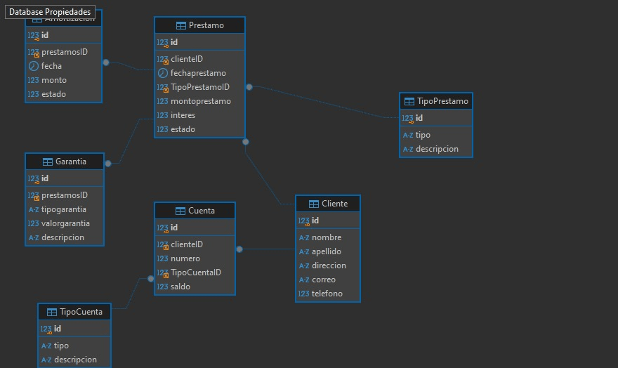

# Proyecto de Gestión de Préstamos

## Descripción
Este proyecto es una API RESTful desarrollada con Node.js, TypeScript y Sequelize para gestionar de forma eficiente los préstamos de una institución financiera. Permite realizar operaciones CRUD sobre clientes, préstamos, garantías y cuentas bancarias, entre otras entidades.


## Estructura del Proyecto
* **Modelos:** Representan las entidades del sistema (Cliente, Préstamo, Garantía, etc.).
* **Controladores:** Manejan la lógica de negocio y exponen los endpoints de la API.
* **Rutas:** Definen las URL y los métodos HTTP para acceder a los controladores.

 **Controladores**: Se han implementado controladores para manejar la lógica de negocio de las entidades mencionadas anteriormente. Cada controlador tiene métodos para:
  - Crear nuevos registros.
  - Obtener todos los registros o un registro específico.
  - Actualizar registros existentes.
  - Eliminar registros.

- **Rutas**: Se han definido rutas para cada controlador, permitiendo el acceso a las funciones de la API a través de solicitudes HTTP.

### Relaciones Clave
* **Cliente - Préstamo:** Un cliente puede tener múltiples préstamos.
* **Préstamo - Garantía:** Un préstamo puede tener múltiples garantías.
* **Cliente - CuentaBancaria:** Un cliente puede tener múltiples cuentas bancarias.

## Modelo Relacional
A continuación se presenta el modelo relacional del sistema:


## Instalación

Para clonar el repositorio y configurar el proyecto en tu máquina local, sigue los siguientes pasos:

1. **Clona el repositorio**:
   ```bash
   git clone <URL_DEL_REPOSITORIO>
   cd <NOMBRE_DEL_REPOSITORIO>

# NOTA: 
INSTALAR LAS DEPENDENCIAS CON:
```bash
npm install 
npm install morgan nodemon 
npm install sequelize mysql2 @types/sequelize
